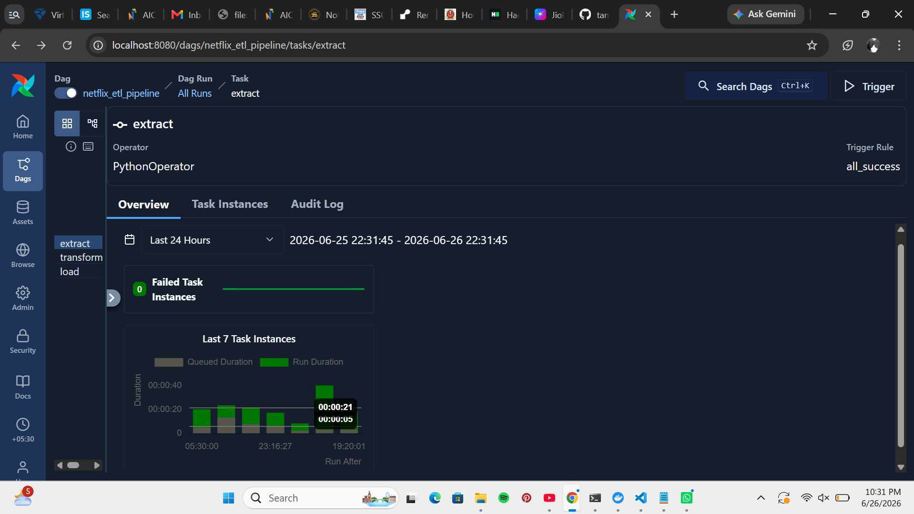
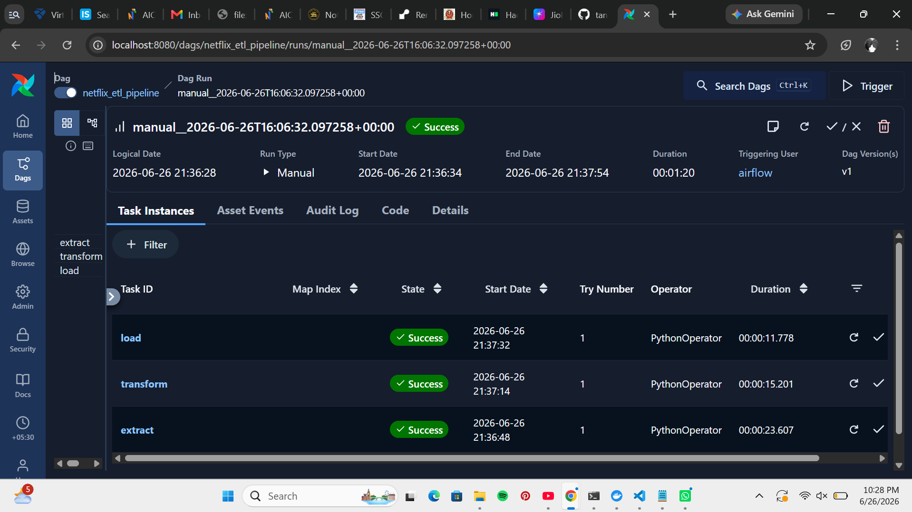
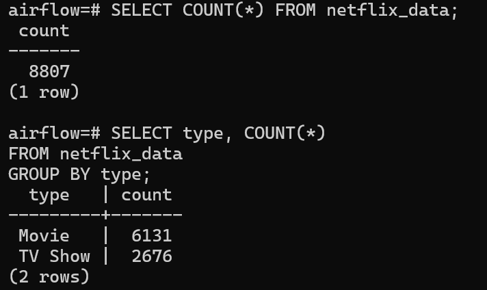
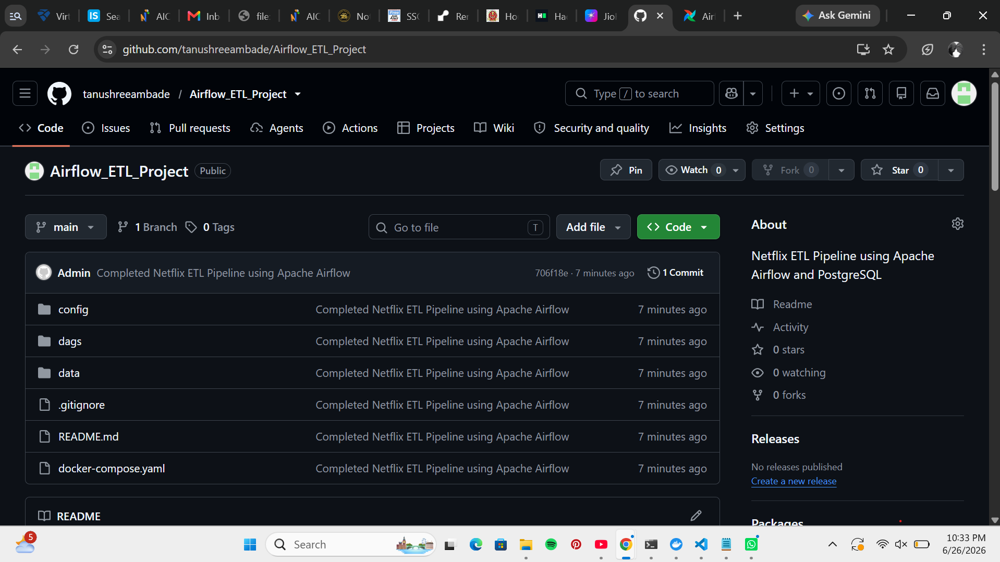

# Netflix ETL Pipeline using Apache Airflow

**Author:** Tanushree Ambade

---

# Netflix ETL Pipeline

This project demonstrates a complete **ETL (Extract, Transform, Load)** pipeline using **Apache Airflow**, **Python**, **PostgreSQL**, and **Docker**.

The pipeline automatically extracts the Netflix dataset, performs data cleaning and transformation, and loads the processed data into PostgreSQL. Apache Airflow is used to orchestrate and schedule each stage of the workflow.

---

## Technologies Used

* Apache Airflow 3
* Python
* PostgreSQL
* Docker & Docker Compose
* Pandas
* SQLAlchemy

---

## ETL Workflow

1. Extract Netflix dataset
2. Transform and clean the data
3. Load processed data into PostgreSQL

---

## Dataset

* Netflix Movies & TV Shows Dataset
* Total Records Loaded: **8807**

---

## Output

* Automated ETL Pipeline
* Data Cleaning & Transformation
* PostgreSQL Database Integration
* Apache Airflow DAG Scheduling
* Dockerized Development Environment

---

## Project Structure

```text
Airflow_ETL_Project/
│
├── dags/
│   └── netflix_etl_dag.py
│
├── config/
│
├── data/
│   ├── netflix_titles.csv
│   └── netflix_final.csv
│
├── screenshots/
│   ├── airflow_graph.png
│   ├── airflow_grid.png
│   ├── postgres_count.png
│   └── github_repo.png
│
├── docker-compose.yaml
├── requirements.txt
├── README.md
└── .gitignore
```

---

# Screenshots

## Airflow Graph



---

## Airflow Grid



---

## PostgreSQL Verification



---

## GitHub Repository



---

## PostgreSQL Verification Query

```sql
SELECT COUNT(*) FROM netflix_data;
```

Output

```text
 count
-------
 8807
```

Verify Movie & TV Show Count

```sql
SELECT type, COUNT(*)
FROM netflix_data
GROUP BY type;
```

Output

```text
 type      | count
-----------+-------
 Movie     | 6131
 TV Show   | 2676
```

---

## Future Improvements

* Add data validation checks
* Integrate AWS S3 for cloud storage
* Deploy Apache Airflow on Kubernetes
* Build a Power BI dashboard
* Add email notifications for DAG failures

---

# Conclusion

This project demonstrates an end-to-end ETL pipeline built using **Apache Airflow**, **Python**, **PostgreSQL**, and **Docker**. It automates the extraction, transformation, and loading of Netflix data into a relational database while showcasing workflow orchestration and scheduling.

Through this project, I strengthened my understanding of:

* ETL pipeline development
* Workflow orchestration with Apache Airflow
* PostgreSQL database integration
* Docker containerization
* Data engineering best practices

---

⭐ **If you found this project useful, please consider giving it a Star on GitHub!**
